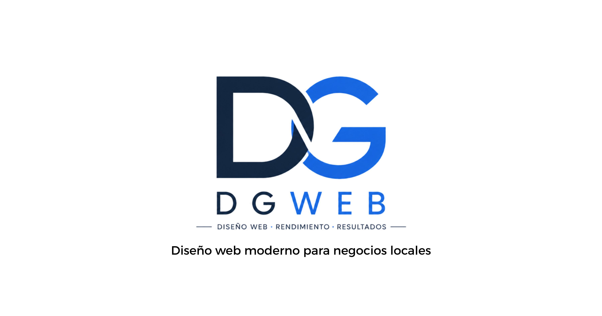

# DG Web Studio

Diseño web moderno para negocios locales.



---

## 🚀 Proyecto

DG Web Studio es una web portfolio profesional desarrollada con tecnologías modernas para ofrecer servicios de diseño y desarrollo web orientados a pequeños negocios locales.

La web está enfocada en:
- transmitir confianza
- diseño moderno
- alto rendimiento
- experiencia premium
- captación de clientes
- SEO local

---

## ✨ Características

- Diseño moderno y minimalista
- Responsive mobile-first
- Optimización SEO avanzada
- Formularios funcionales con Resend
- Integración de correo profesional
- Animaciones suaves con Framer Motion
- Optimización de imágenes
- Lighthouse optimizado
- Metadata avanzada
- Open Graph + Twitter Cards
- Schema.org Structured Data
- Sitemap dinámico
- Robots.txt automático
- Integración con Google Search Console
- Deploy profesional en Vercel

---

## 🛠️ Stack Tecnológico

- Next.js 15
- React
- TypeScript
- Tailwind CSS
- Framer Motion
- Resend
- Vercel
- Cloudflare
- Zoho Mail

---

## 📂 Estructura del proyecto

```bash
src/
 ├── app/
 │   ├── api/
 │   ├── layout.tsx
 │   ├── page.tsx
 │   ├── sitemap.ts
 │   └── robots.ts
 │
 ├── components/
 │   ├── Navbar.tsx
 │   ├── Hero.tsx
 │   ├── Services.tsx
 │   ├── Portfolio.tsx
 │   ├── CTA.tsx
 │   ├── Contact.tsx
 │   └── Footer.tsx
```

---

## 💼 Servicios

- Diseño web corporativo
- Landing pages
- Modernización de páginas antiguas
- SEO local básico
- Optimización móvil
- Formularios y automatización
- Integración WhatsApp
- Soporte y mantenimiento

---

## 📸 Proyectos incluidos

- Clínica Dental Gómez Rozas
- Nos Pilates
- Mary Groom
- Teyca Sabadell

---

## ⚡ Rendimiento

La web está optimizada para:
- velocidad de carga
- experiencia móvil
- SEO técnico
- accesibilidad
- rendimiento visual

---

## 🌍 Dominio y correo profesional

- Dominio personalizado con Cloudflare
- Correo profesional con Zoho Mail
- Envío de formularios mediante Resend

---

## 📈 SEO

Incluye:
- Open Graph
- Twitter Cards
- Schema.org
- Sitemap.xml
- Robots.txt
- Metadata avanzada
- Keywords locales

---

## 📬 Contacto

📧 contacto@dg-webstudio.com

📱 +34 628 247 900

🌐 https://dg-webstudio.com

---

## 🚀 Deploy

El proyecto está desplegado en:

### https://dg-webstudio.com

---

## 📄 Licencia

Proyecto desarrollado por David García.

Todos los derechos reservados.